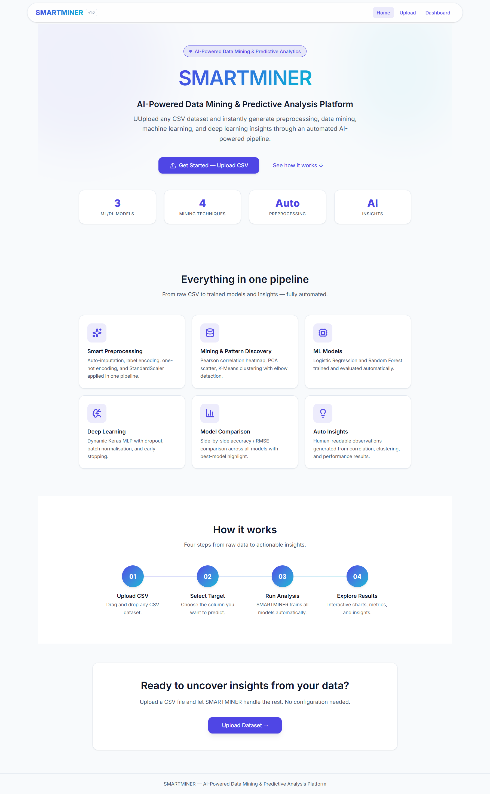
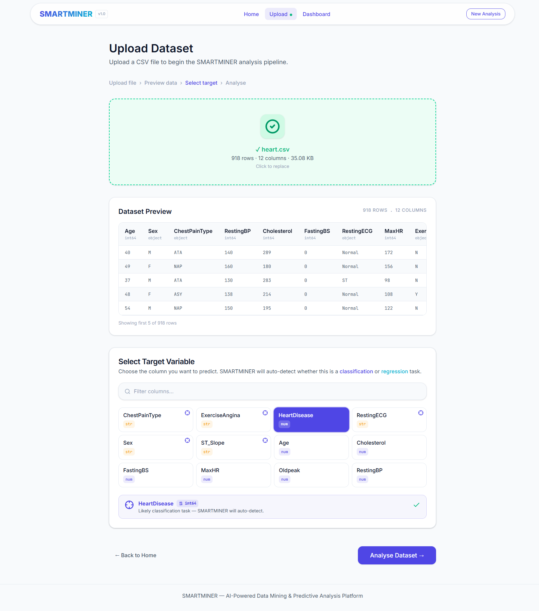
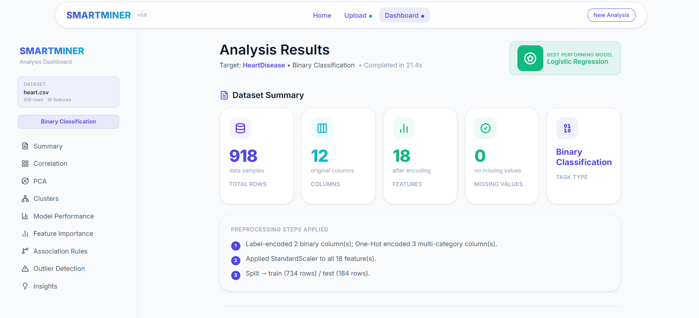
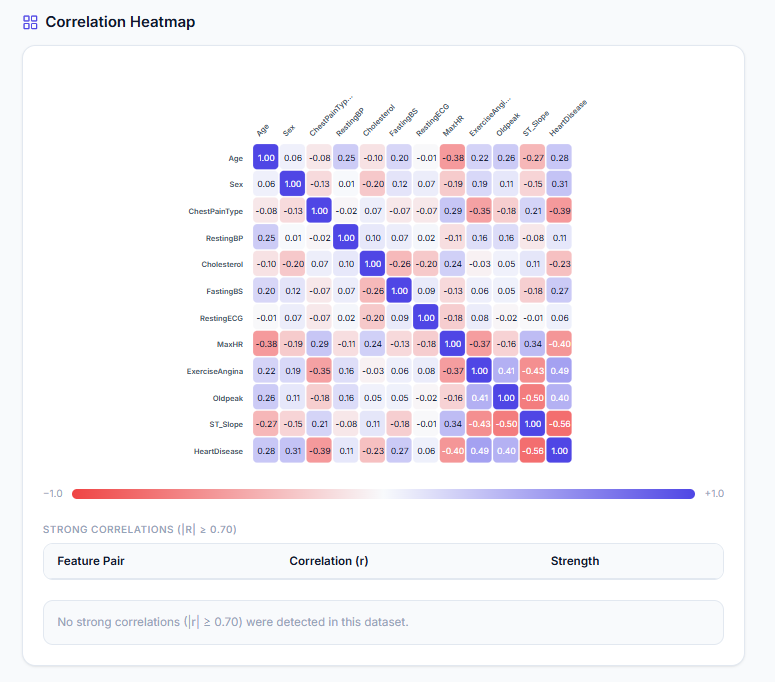
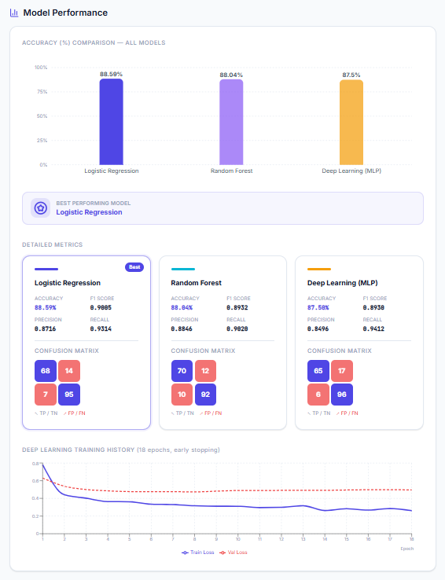
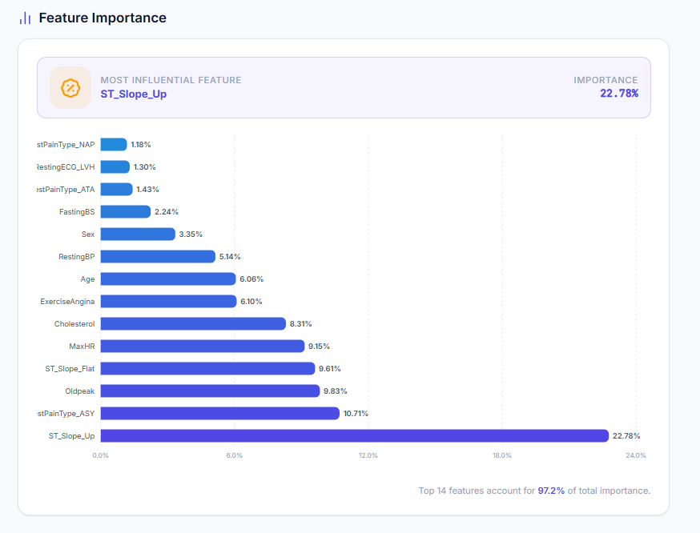
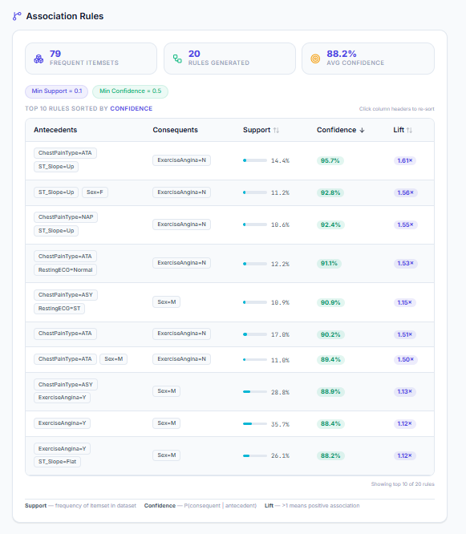
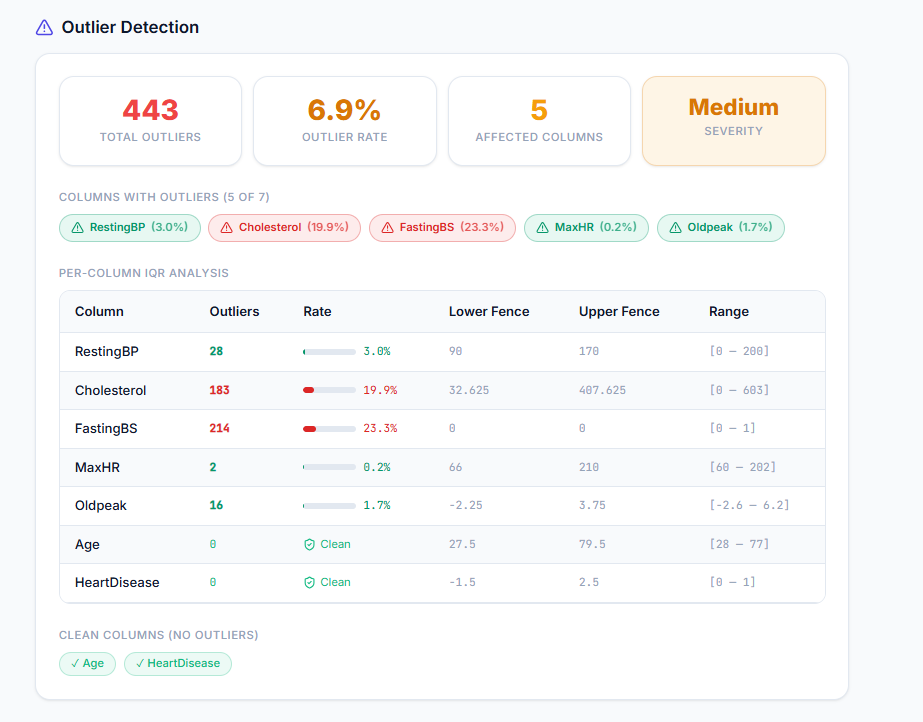
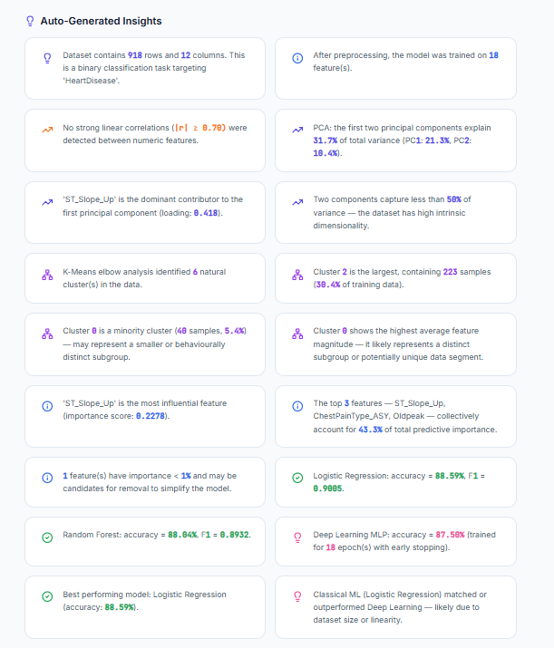

# SMARTMINER

### AI-Powered Data Mining & Predictive Analysis Platform


SMARTMINER is a full-stack AI-powered Data Mining and Predictive Analysis Platform that automates the complete data mining workflow for structured datasets. The platform enables users to upload datasets, automatically preprocess data, discover hidden patterns, train predictive models, evaluate results, and generate visual insights through an interactive dashboard.

---

## Overview

Traditional data analysis often requires expertise in preprocessing, machine learning, model selection, and result interpretation. SMARTMINER simplifies this process by providing an automated end-to-end data mining pipeline that transforms raw datasets into actionable insights.

The platform supports:

* Automated Data Preprocessing
* Correlation Analysis
* Principal Component Analysis (PCA)
* K-Means Clustering
* Association Rule Mining
* Outlier Detection
* Machine Learning Models
* Deep Learning Models
* Interactive Visualizations
* Automated Insight Generation

---

## Highlights

- End-to-end automated data mining
- Interactive visual analytics
- Machine Learning & Deep Learning
- PCA & Clustering
- Association Rule Mining
- Insight Generation Engine

---

## Screenshots

### Home Page



### Dataset Upload



### Dashboard Overview



### Correlation Analysis



### PCA & Clustering


### Model Performance



### Feature Importance



### Association Rules



### Outlier Detection



### Automated Insights



---

## Key Features

### Automated Data Preprocessing

SMARTMINER automatically:

* Handles missing values
* Encodes categorical features
* Standardizes numerical features
* Detects target variable type
* Splits datasets into training and testing sets

### Data Mining

* Correlation Analysis
* Principal Component Analysis (PCA)
* K-Means Clustering
* Apriori Association Rule Mining
* Outlier Detection using IQR

### Machine Learning

#### Classification

* Logistic Regression
* Random Forest Classifier

#### Regression

* Linear Regression
* Random Forest Regressor

### Deep Learning

#### Multi-Layer Perceptron (MLP)

Built using:

* TensorFlow
* Keras

Features:

* Dense Layers
* Dropout Regularization
* Early Stopping

### Interactive Dashboard

* Dataset Summary
* Correlation Heatmap
* PCA Visualization
* Cluster Visualization
* Feature Importance Analysis
* Model Comparison
* Outlier Analysis
* Automated Insights

---

## Problem Statement

Organizations and individuals often struggle to extract meaningful insights from data because of:

* Manual preprocessing requirements
* Complex machine learning workflows
* Difficulty selecting appropriate algorithms
* Lack of technical expertise
* Multiple disconnected analysis tools

SMARTMINER addresses these challenges by automating the complete data mining and predictive analytics workflow within a single platform.

---

## Objectives

* Automate the complete data mining pipeline
* Reduce manual preprocessing effort
* Compare multiple machine learning models automatically
* Generate meaningful insights from datasets
* Provide interactive visualizations
* Support datasets from multiple domains
* Make data analysis accessible to non-technical users

---

## System Architecture

```text
Dataset Upload
      │
      ▼
Data Validation
      │
      ▼
Data Preprocessing
      │
      ▼
Data Mining Pipeline
 ├── Correlation Analysis
 ├── PCA
 ├── Clustering
 ├── Association Rule Mining
 ├── Outlier Detection
 ├── Machine Learning
 └── Deep Learning
      │
      ▼
Model Evaluation
      │
      ▼
Insight Generation
      │
      ▼
Interactive Dashboard
```

---

## Technologies Used

### Frontend

* React
* Vite
* Tailwind CSS
* Recharts
* Lucide React

### Backend

* FastAPI
* Python

### Data Analysis & Machine Learning

* Pandas
* NumPy
* Scikit-learn
* SciPy
* Mlxtend
* TensorFlow
* Keras

---

## Data Mining Techniques

| Technique            | Purpose                        |
| -------------------- | ------------------------------ |
| Correlation Analysis | Discover feature relationships |
| PCA                  | Dimensionality Reduction       |
| K-Means Clustering   | Group Similar Records          |
| Apriori Algorithm    | Association Rule Mining        |
| Classification       | Predict Categorical Outcomes   |
| Regression           | Predict Numerical Outcomes     |
| Outlier Detection    | Detect Anomalies               |

---

## Project Structure

```text
smartminer-ai
│
├── backend
│   ├── routes
│   │   ├── upload.py
│   │   └── process.py
│   │
│   ├── services
│   │   ├── preprocessing.py
│   │   ├── data_mining.py
│   │   ├── ml_models.py
│   │   ├── dl_model.py
│   │   └── insight_generator.py
│   │
│   ├── utils
│   │   ├── file_handler.py
│   │   ├── problem_detector.py
│   │   └── response_builder.py
│   │
│   ├── main.py
│   ├── requirements.txt
│   └── runtime.txt
│
├── frontend
│   ├── public
│   │
│   ├── src
│   │   ├── api
│   │   │   └── smartminer.js
│   │   │
│   │   ├── assets
│   │   │
│   │   ├── components
│   │   │   ├── common
│   │   │   │   ├── Badge.jsx
│   │   │   │   ├── ErrorAlert.jsx
│   │   │   │   └── LoadingSpinner.jsx
│   │   │   │
│   │   │   ├── dashboard
│   │   │   │   ├── SummaryCards.jsx
│   │   │   │   ├── CorrelationHeatmap.jsx
│   │   │   │   ├── PCAScatterPlot.jsx
│   │   │   │   ├── ClusterPlot.jsx
│   │   │   │   ├── ModelPerformance.jsx
│   │   │   │   ├── FeatureImportance.jsx
│   │   │   │   ├── AssociationRules.jsx
│   │   │   │   ├── OutlierSummary.jsx
│   │   │   │   └── InsightsPanel.jsx
│   │   │   │
│   │   │   ├── layout
│   │   │   │   ├── Navbar.jsx
│   │   │   │   ├── Footer.jsx
│   │   │   │   └── PageWrapper.jsx
│   │   │   │
│   │   │   └── upload
│   │   │       ├── FileDropzone.jsx
│   │   │       ├── DataPreviewTable.jsx
│   │   │       └── TargetSelector.jsx
│   │   │
│   │   ├── context
│   │   │   └── AnalysisContext.jsx
│   │   │
│   │   ├── hooks
│   │   │   ├── useAnalysis.js
│   │   │   └── useUpload.js
│   │   │
│   │   ├── pages
│   │   │   ├── HomePage.jsx
│   │   │   ├── UploadPage.jsx
│   │   │   └── DashboardPage.jsx
│   │   │
│   │   ├── utils
│   │   │   ├── constants.js
│   │   │   ├── formatters.js
│   │   │   └── chartHelpers.js
│   │   │
│   │   ├── App.jsx
│   │   ├── index.css
│   │   └── main.jsx
│   │
│   ├── package.json
│   ├── vite.config.js
│   ├── eslint.config.js
│   └── index.html
│
├── .gitignore
└── README.md
```

---

## Requirements

- Python 3.12+
- Node.js 18+
- npm 9+

Tested on Python 3.12.10.

---

## Installation

### Clone Repository

```bash
git clone https://github.com/ahadbuilds/smartminer-ai.git
cd smartminer-ai
```

### Backend Setup

```bash
cd backend

pip install -r requirements.txt

uvicorn main:app --reload
```

Backend runs at:

```text
http://127.0.0.1:8000
```

### Frontend Setup

```bash
cd frontend

npm install

npm run dev
```

Frontend runs at:

```text
http://localhost:3000
```

---

## Workflow

### Step 1

Upload CSV Dataset

### Step 2

Select Target Column

### Step 3

Automatic Data Preprocessing

### Step 4

Data Mining Analysis

### Step 5

Machine Learning & Deep Learning

### Step 6

Model Evaluation

### Step 7

Interactive Dashboard Visualization

### Step 8

Automated Insight Generation

---

## Dashboard Modules

* Dataset Summary
* Correlation Heatmap
* PCA Scatter Plot
* Cluster Visualization
* Feature Importance
* Model Performance
* Association Rules
* Outlier Detection
* Automated Insights

---

## Future Enhancements

* PDF Report Generation
* Dataset History Management
* AutoML Integration
* Explainable AI (XAI)
* Real-Time Analytics
* Cloud Deployment
* User Authentication
* Team Collaboration Features

---

## Learning Outcomes

SMARTMINER demonstrates practical implementation of:

* Data Mining
* Machine Learning
* Deep Learning
* Data Preprocessing
* Predictive Analytics
* Pattern Discovery
* Data Visualization
* Automated Insight Generation

within a unified intelligent analytics platform.

---

## Developer

**Abdul Ahad**

BS Computer Science
University of Engineering & Technology (UET), Lahore

### Skills

* Data Mining
* Machine Learning
* Deep Learning
* Data Analytics
* FastAPI
* React
* Python

---

## License

This project is intended for educational, research, and portfolio purposes.

---

## SMARTMINER

**Transforming raw data into actionable insights through AI-powered data mining and predictive analytics.**
